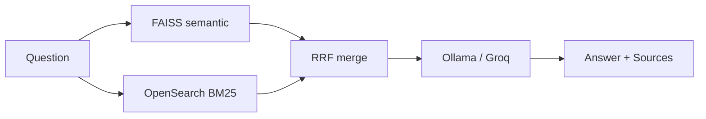

# AI Governance Knowledge Assistant

RAG pipeline over **official regulatory PDFs** — EU AI Act, NIST AI RMF, India DPDP Act — with hybrid retrieval, evaluation, and citations.

> **Use case:** Enterprise compliance teams cannot keyword-search 200-page regulations. This assistant answers natural-language governance questions with source citations.

---

## Status: Phase 4 (Evaluation)

| Phase | Feature | Status |
|-------|---------|--------|
| 1 | PDF ingest → FAISS → CLI Q&A | Done |
| 2 | OpenSearch BM25 + RRF + FastAPI | Done |
| 3 | Pinecone backend (demo mode) | Skipped for now |
| 4 | RAGAS eval + golden_qa.json | Done |
| 5 | Demo scripts + integration with P2 | In progress |

**Related:** [Langgraph-Multitool-agent](https://github.com/laharsh/Langgraph-Multitool-agent-) — governance **operations** layer (LangGraph) calls this API.  
Story: [projects-plan/P1_P2_PRODUCT_STORY.md](../projects-plan/P1_P2_PRODUCT_STORY.md)

See [docs/USE_CASE.md](docs/USE_CASE.md), [docs/INTEGRATION.md](docs/INTEGRATION.md), [projects-plan/FREE_TIER_BUDGET.md](../projects-plan/FREE_TIER_BUDGET.md).

---

## Evaluation snapshot (refresh before resume)

| Metric | Value (10 Q, Groq judge) | Command |
|--------|--------------------------|---------|
| Faithfulness | 0.34 | `python -m src.eval --limit 10 --ragas-only --judge groq` |
| Answer relevancy | 0.86 | |
| Context precision | 0.36 | |
| Keyword pass (NIST subset) | 100% pass, ~0.80 avg | `python -m src.eval --limit 10 --keyword-only` |

Full golden set: 50 questions in `golden_qa.json`. Close-out: [TODO.md](TODO.md).

---

## Architecture (Phase 2 — hybrid retrieval)



---

## Quick start

### 1. Prerequisites

- Python 3.11+
- Docker Desktop (for OpenSearch)
- [Ollama](https://ollama.com) with `llama3.2:3b`

```bash
ollama pull llama3.2:3b
```

### 2. Setup

```bash
cd rag-eval-platform
python -m venv .venv
.venv\Scripts\activate        # Windows
pip install -r requirements.txt
copy .env.example .env
```

### 3. Start OpenSearch + ingest

```bash
docker compose up -d
python scripts\download_docs.py   # if PDFs not present
python -m src.ingest
```

### 4. Ask via CLI or API

```bash
# CLI
python -m src.rag_chain "What practices are prohibited under Article 5 of the EU AI Act?"

# API
uvicorn src.api:app --reload --port 8000
curl -X POST http://localhost:8000/ask -H "Content-Type: application/json" -d "{\"question\": \"What are the NIST AI RMF functions?\"}"
```

### 5. Evaluate (Phase 4)

```bash
pip install -r requirements-eval.txt          # once (RAGAS deps)

# Fast: 10 questions, keyword regression only
python -m src.eval --limit 10 --keyword-only

# Full keyword suite (50 questions)
python -m src.eval --keyword-only

# RAGAS metrics (Ollama judge — saves Groq)
python -m src.eval --limit 10 --ragas --judge ollama
```

See [docs/EVAL.md](docs/EVAL.md).

### 6. Tests

```bash
pytest tests/ -q
```

---

## Free tier strategy

| While coding | For demo video |
|--------------|----------------|
| `LLM_PROVIDER=ollama` | `LLM_PROVIDER=groq` |
| `VECTOR_BACKEND=faiss` | `VECTOR_BACKEND=pinecone` |

Never burn Groq/Pinecone quota during daily development.

---

## Demo questions

1. What practices are prohibited under Article 5 of the EU AI Act?
2. What are the four functions in the NIST AI RMF?
3. How does India DPDP define personal data?
4. What are the penalties for violating the EU AI Act?

---

## Live demo (Render + React UI)

1. `python scripts\prepare_deploy.py` after ingest  
2. Deploy API + static UI — [docs/DEPLOY.md](docs/DEPLOY.md)  
3. Local UI: `cd demo-ui && npm install && npm run dev`

## Demo script (Loom)

```powershell
uvicorn src.api:app --port 8000
.\scripts\demo.ps1
```

## Project docs

- [USE_CASE.md](docs/USE_CASE.md) — why these PDFs
- [ARCHITECTURE.md](docs/ARCHITECTURE.md) — data flow (beginner-friendly)
- [INTEGRATION.md](docs/INTEGRATION.md) — Project 2 agent API
- [PINECONE.md](docs/PINECONE.md) — optional cloud vector (TODO)
