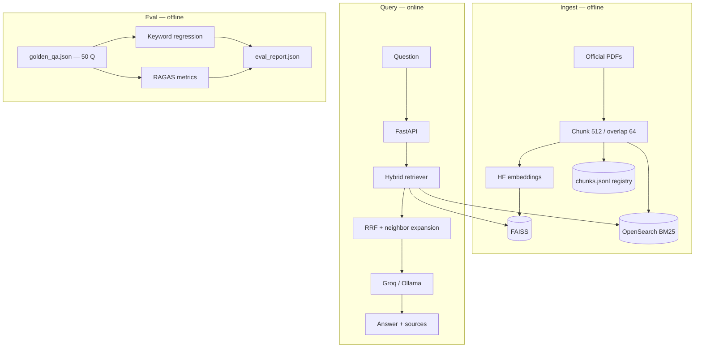

# AI Governance Knowledge Assistant

RAG over **official regulatory PDFs** (EU AI Act, NIST AI RMF 1.0, India DPDP 2023) with **hybrid retrieval**, **cited answers**, and a **50-question golden evaluation harness** (keyword regression + RAGAS).

**Companion project:** [LangGraph governance agent](https://github.com/laharsh/Langgraph-Multitool-agent-) (SQL + regulatory RAG tool) calls this API.

| | |
|---|---|
| **Problem** | Compliance teams cannot keyword-search 200-page regulations; they need natural-language Q&A with traceable sources. |
| **Approach** | Ingest PDFs → chunk → embed → index (vector + keyword) → retrieve → grounded generation → offline eval. |
| **Demo** | React UI (`demo-ui/`) + FastAPI; optional [Render deploy](docs/DEPLOY.md). |

---

## Stack (what & why)

| Layer | Technology | Role in this project |
|-------|------------|----------------------|
| **Orchestration** | LangChain | Document loaders, text splitters, vector store adapters |
| **Embeddings** | Hugging Face `sentence-transformers/all-MiniLM-L6-v2` | Same family used in production RAG; runs locally for ingest/query embedding |
| **Vector search** | FAISS (local index) | Fast dev iteration; index shipped in Docker for hosted demo |
| **Vector search (cloud)** | Pinecone | Managed vector DB — [implementation guide](docs/PINECONE.md) (resume / scale path) |
| **Keyword search** | OpenSearch BM25 | Exact terms (“Article 5”, acronyms); merged with vectors via **RRF** |
| **Generation** | Groq API (demo) / Ollama (optional dev) | Answers from retrieved context only |
| **API** | FastAPI | `/health`, `/ask` with source payloads |
| **Evaluation** | Custom golden harness + **RAGAS** | Faithfulness, answer relevancy, context precision |
| **UI** | Vite + React | Governance console; API keys stay on server |

---

## Architecture



Details: [docs/ARCHITECTURE.md](docs/ARCHITECTURE.md) · [docs/USE_CASE.md](docs/USE_CASE.md)

---

## Evaluation results

Frozen snapshot: [`eval_summary.json`](eval_summary.json). Latest RAGAS dump: `eval_report.json`.

| Suite | n | Metric | Score |
|-------|---|--------|-------|
| Keyword regression (full RAG answers) | 50 | Pass rate | **80%** (avg keyword hit **0.76**) |
| RAGAS · Groq judge (`openai/gpt-oss-20b`) | 50 | Faithfulness | **0.44** |
| RAGAS · Groq judge | 50 | Answer relevancy | **0.86** |
| RAGAS · Groq judge | 50 | Context precision | **0.27** |

**How to read this:** answers usually match the question (relevancy). Citations still mix in weakly related chunks (context precision / faithfulness). That is a retrieval problem to improve next (chunking A/B, Pinecone, hybrid vs vector-only)—not a reason to hide the numbers.

Reproduce (Groq quota; skip Ollama for published numbers):

```powershell
pip install -r requirements-eval.txt
python -m src.eval --keyword-only
python -m src.eval --ragas-only --judge groq
```

Chunking A/B (document in README after runs):

```powershell
# Bad chunks — re-ingest, then:
$env:CHUNK_SIZE="1000"; $env:CHUNK_OVERLAP="0"
python -m src.ingest
python -m src.eval --ragas-only --judge groq
# save copy: eval_report_chunk1000.json

# Good chunks (default) — re-ingest, then:
$env:CHUNK_SIZE="512"; $env:CHUNK_OVERLAP="64"
python -m src.ingest
python -m src.eval --ragas-only --judge groq
# save copy: eval_report_chunk512.json
```

See [docs/EVAL.md](docs/EVAL.md) · step-by-step [EVAL_RUNBOOK.md](docs/EVAL_RUNBOOK.md).

---

## Quick start

**Prerequisites:** Python 3.11+, Docker Desktop (OpenSearch), Groq API key in `.env` for demos.

```powershell
cd rag-eval-platform
python -m venv .venv
.\.venv\Scripts\activate
pip install -r requirements.txt
copy .env.example .env
# Set GROQ_API_KEY, LLM_PROVIDER=groq for UI/Loom

docker compose up -d
python scripts\download_docs.py
python -m src.ingest

uvicorn src.api:app --port 8000
```

**UI:** `cd demo-ui && npm install && npm run dev` → http://localhost:5173

**Tests:** `pytest tests/ -q`

---

## Demo scripts (`scripts/demo.ps1`, `scripts/demo.sh`)

Optional **API smoke test** — not required if you use the React UI. They call `/health` and POST three governance questions to `localhost:8000` and print short answers. Useful for Loom B-roll or CI-style checks.

```powershell
uvicorn src.api:app --port 8000
.\scripts\demo.ps1
```

---

## Deployment

Hosted FAISS bundle (vector-only, no OpenSearch): [docs/DEPLOY.md](docs/DEPLOY.md)

---

## Documentation

| Doc | Contents |
|-----|----------|
| [USE_CASE.md](docs/USE_CASE.md) | Corpus & demo questions |
| [EVAL.md](docs/EVAL.md) | Evaluation design |
| [PINECONE.md](docs/PINECONE.md) | Cloud vector backend |
| [INTEGRATION.md](docs/INTEGRATION.md) | Project 2 API contract |
| [LOOM_P1.md](docs/LOOM_P1.md) | Recording checklist |
| [LOOM_SCRIPT_P1.md](docs/LOOM_SCRIPT_P1.md) | Narration script |

**Learning path (mentor order):** [../projects-plan/AI_ENGINEERING_CURRICULUM.md](../projects-plan/AI_ENGINEERING_CURRICULUM.md)

---

## License

Portfolio / educational use. Regulatory PDFs remain property of their publishers; links in `scripts/download_docs.py`.
